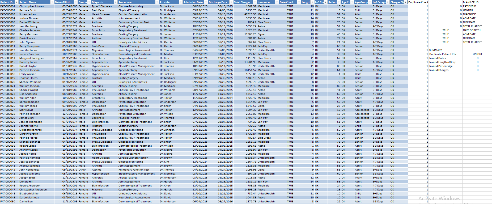
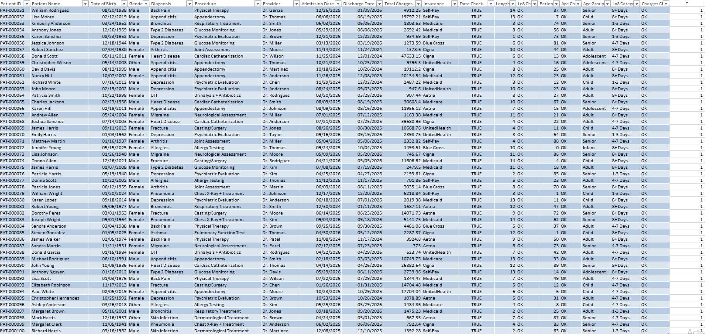
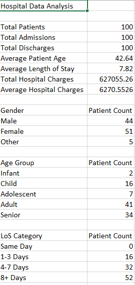
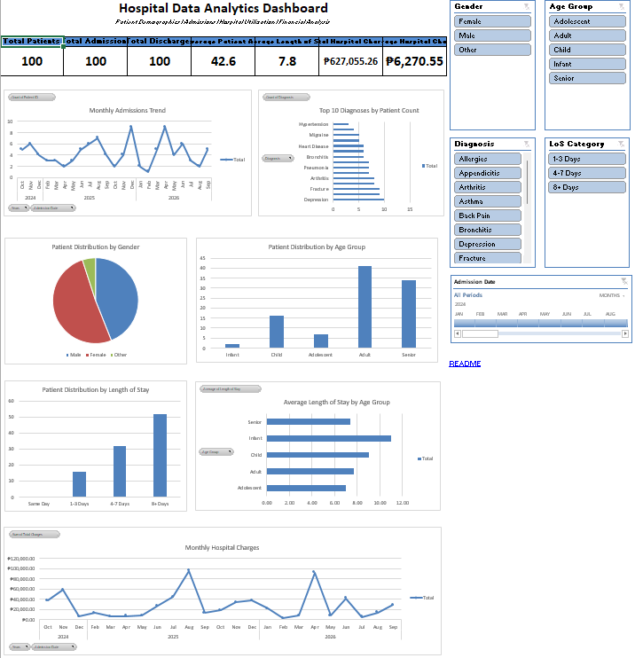

Hospital Data Analytics Dashboard | Microsoft Excel
📊 Project Overview
This project is a healthcare data analytics portfolio project developed in Microsoft Excel to analyze hospital patient data and provide clear insights through an interactive dashboard.

The project demonstrates the use of Excel for data preparation, data validation, analysis, visualization, and dashboard development.

🎯 Project Objectives
Clean and validate hospital patient data

Analyze patient demographics and admission patterns

Analyze diagnoses and hospital utilization

Examine length of stay and hospital charges

Transform patient-level data into meaningful analytical insights

Develop an interactive dashboard for easier data exploration

🛠️ Tools & Technologies
Microsoft Excel

Excel Tables

Excel Formulas & Functions

PivotTables

PivotCharts

KPI Cards

Slicers

Timeline

🔍 Data Preparation & Validation

The dataset was prepared and validated before analysis.

Data-quality checks included:

Duplicate Patient ID checks

Admission and Discharge Date validation

Patient Age validation

Length of Stay validation

Hospital Charges validation

Calculated fields were also created, including:

Patient Age

Age Group

Length of Stay

LOS Category

📈 Analysis Performed

The project analyzed:

Total patients and admissions

Patient demographics

Gender distribution

Age group distribution

Length of stay categories

Diagnoses and top diagnoses

Monthly admissions

Monthly hospital charges

Average length of stay by age group and diagnosis

Hospital charges by diagnosis

📊 Interactive Dashboard

The final Excel dashboard includes:

KPI cards

Monthly admissions trend

Top 10 diagnoses

Gender distribution

Age group distribution

Length of stay distribution

Average length of stay by age group

Monthly hospital charges

Interactive slicers

Admission date timeline

The dashboard allows users to filter and explore the data according to different categories.

💡 Key Learning
This project demonstrated how Microsoft Excel can be used beyond basic spreadsheet tasks. By combining data cleaning, formulas, PivotTables, PivotCharts, KPIs, slicers, and dashboard design, Excel can be used to perform meaningful data analysis and communicate insights effectively.

📁 Project Files
Hospital_Data_Analytics_Portfolio.xlsx — Complete Excel workbook

Hospital_Data_Analytics_Case_Study.pdf — Project case study presentation

Hospital_Data_Analytics_Dashboard.png — Dashboard screenshot

Hospital_Data_Analytics_Analysis_1.png — Analysis screenshot

Hospital_Data_Preparation.png — Data preparation screenshot

👤 Author
Walter Abaya

Data Analytics • Microsoft Excel • Business Intelligence
